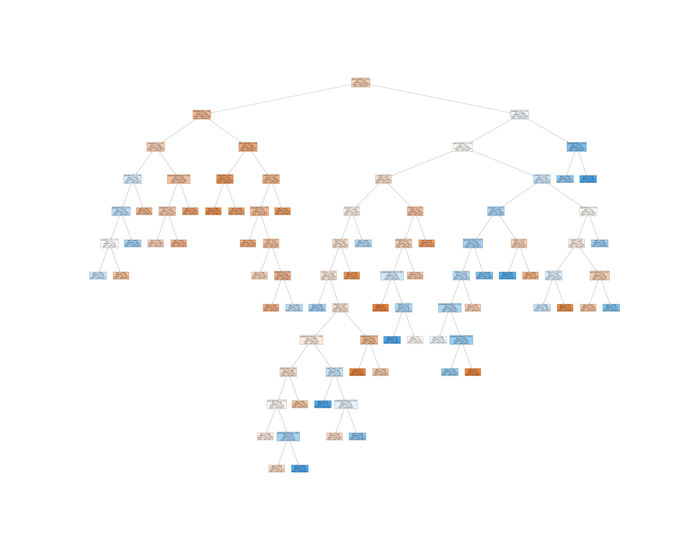

# Soccer Analysis And Prediction
This project aims develop a website platform to analysis soccer and predict match result. Result of data analysis display to user by visualization. 

Data analysis of competition includes basic statistic, which are player, match events, spatial distribution of event and intra-match evaluate of the events in the match, decision tree for find more than one goal of match, pass and shot events relation between team, pass network and heatmap in game.

User can input formation and lineups of team as feature into neural network model to predict home team is win, draw or lose of match.

## Analysis features
### Team pass network
Network Science has been applied in soccer to evaluate performance and team organization. It can help coath to deiges stranger and trainning for player.

### Decision number of goals from match statistic data
To used statistic data of a match, such as number of pass, shot, attact ..., buill a decision tree to predict and find features to affect a match can not have more that one goals. <a id="raw-url" href="static/img/tree.jpg">Download Tree</a>

### Team passes of pitch
plot frequency of pass event in soccer pitch to find a team attack pattern.

### Pass and shot relationship

### Heat map

### Goal action

## Match prediction

## Setup
### 1. Install Requirements
run `pip install -r requirements.txt` to install require library 

### 2. Dowload Require data
create **StatsBomb** folder in `./static/data/` and dowload [StatsBomb](https://github.com/statsbomb/open-data) open data place to there
create another folder call **events** in `./static/data/` and download [Wyscout](https://figshare.com/articles/dataset/Events/7770599?backTo=/collections/Soccer_match_event_dataset/4415000) open data and place to there

### 3.Data preparation
Run **convertData.ipynb** in `./public-notebooks/socceraction` to convert data to hierarchical data format 

### 4.Running
input `python manage.py runserver` in terminal running project in localhost e.g. `http://127.0.0.1:8000/soccerAnalysisAndPrediction/` to Main page
